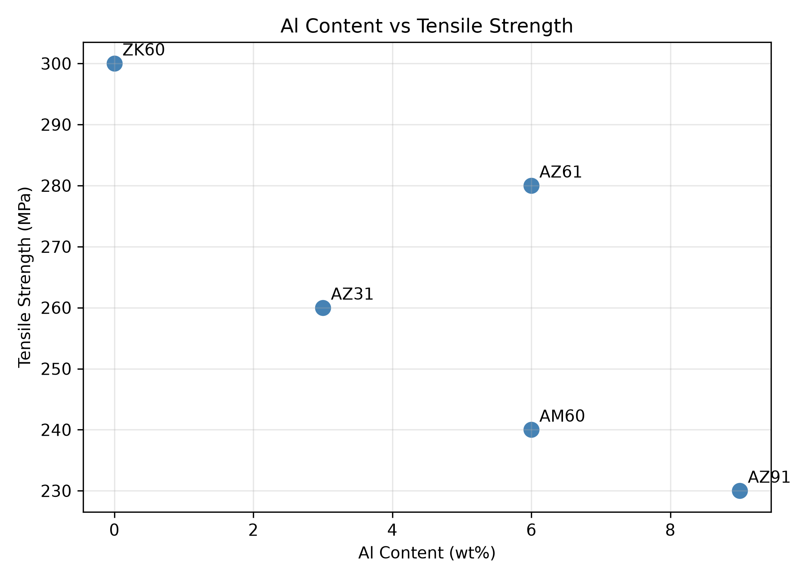

# Materials ML Learning

A step-by-step repository for learning materials data analysis and machine learning with Python.

## Current Progress

- Created an isolated Python virtual environment
- Built a materials dataset with pandas
- Calculated the average tensile strength
- Visualized the relationship between Al content and tensile strength
- Saved the analysis figure automatically

## Example Result



## Technologies

- Python
- pandas
- matplotlib
- Git and GitHub

## Run the Example

```bash
python 01_explore_alloy_data.py