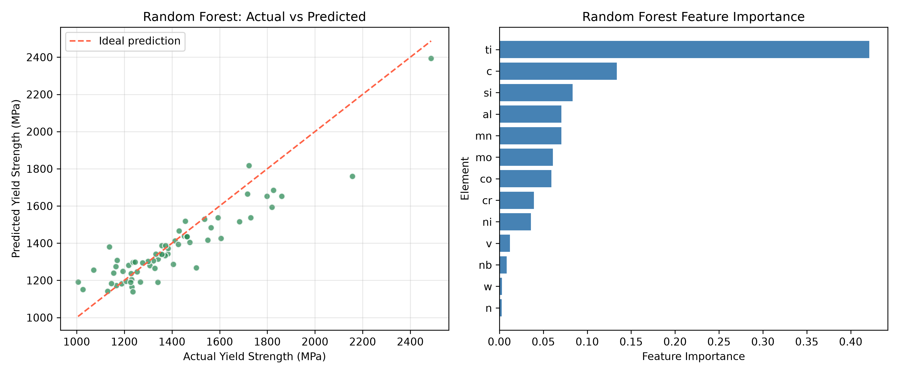
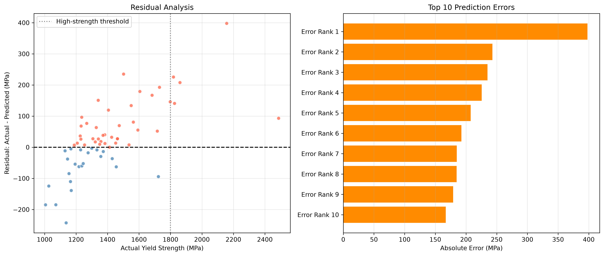
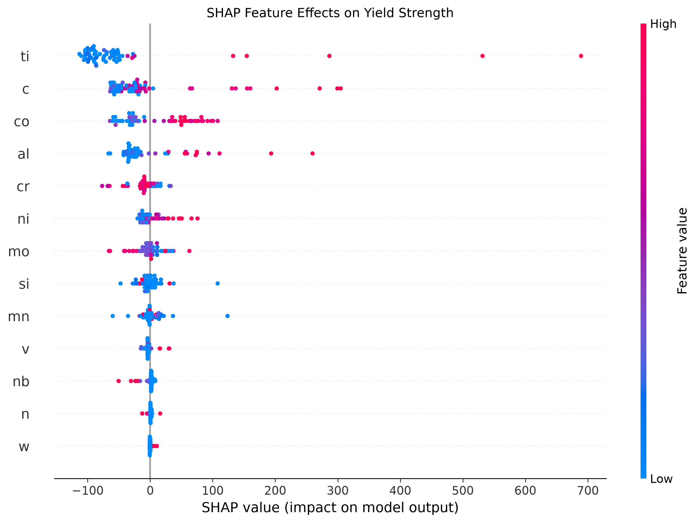

# Materials ML Learning

A reproducible machine-learning project for predicting steel yield strength from chemical composition.

本项目使用 Python 和材料信息学公开数据，完成钢材数据获取、清洗、探索性分析、模型训练、交叉验证、超参数搜索、误差分析、SHAP解释、模型保存和新成分预测。

> 当前版本为学习和科研演示项目，模型结果不能直接用于工程设计。

## Project Highlights

- 312条实验钢材数据
- 13种化学成分特征，单位为质量百分数（wt%）
- 线性回归基线与随机森林对比
- 独立测试集最终评估
- 五折交叉验证与超参数搜索
- SHAP全局模型解释
- 高强度样本误差分析
- 可复用模型文件
- 交互式新成分预测程序
- 一键运行完整流水线

## Dataset

项目使用 matminer 提供的 `steel_strength` 数据集。该数据集包含312种钢材的实验屈服强度、抗拉强度、化学成分和其他材料信息。

模型使用的13个成分特征为：

```text
C, Mn, Si, Cr, Ni, Mo, V, Nb, Co, Al, W, Ti, N
```

成分单位为 `wt%`，预测目标为屈服强度，单位为 `MPa`。

数据集说明：

- [matminer Dataset Summary](https://hackingmaterials.lbl.gov/matminer/dataset_summary.html)
- 原始数据由 Citrine Informatics 收集并经过去重整理

## Workflow

```text
Load dataset
    ↓
Clean and validate data
    ↓
Exploratory data analysis
    ↓
Mean-value and linear-regression baselines
    ↓
Random-forest regression
    ↓
Cross-validation and hyperparameter search
    ↓
Error and high-strength bias analysis
    ↓
SHAP model interpretation
    ↓
Save model and predict new compositions
```

## Model Results

固定随机种子为42，并保留20%的数据作为独立测试集。

| Model | Test MAE (MPa) | Test RMSE (MPa) | Test R² |
|---|---:|---:|---:|
| Mean baseline | 197.89 | 263.48 | -0.007 |
| Linear regression | 159.88 | 286.22 | -0.189 |
| Random forest | **78.83** | **110.73** | **0.822** |

随机森林五折交叉验证结果：

| Metric | Mean | Standard deviation |
|---|---:|---:|
| MAE | 87.87 MPa | 10.96 MPa |
| RMSE | 124.72 MPa | 16.16 MPa |
| R² | 0.817 | 0.076 |

超参数搜索在训练集内部执行，没有使用测试集选择参数。搜索得到的最佳配置为：

```text
n_estimators      = 500
max_depth         = None
max_features      = 1.0
min_samples_split = 2
min_samples_leaf  = 1
```

测试集上的 `R²=0.822` 是决定系数，不应表述为“82.2%的准确率”。

## Prediction Performance



随机森林明显优于均值基线和线性回归，但高强度区域仍存在低估现象。

## Error Analysis

测试集中：

- 40个样本被低估
- 23个样本被高估
- 全部测试样本平均残差为 `+27.06 MPa`
- 5个不低于1800 MPa的样本平均被低估 `212.97 MPa`
- 最大绝对误差约为 `397.86 MPa`



结果说明随机森林存在向训练数据平均水平回归的倾向，对数据量较少的极高强度钢预测能力有限。

## SHAP Interpretation



平均绝对SHAP值排名前六的元素为：

| Rank | Element | Mean absolute SHAP value |
|---:|---|---:|
| 1 | Ti | 98.17 MPa |
| 2 | C | 58.89 MPa |
| 3 | Co | 46.24 MPa |
| 4 | Al | 41.76 MPa |
| 5 | Cr | 16.16 MPa |
| 6 | Ni | 14.70 MPa |

SHAP值描述元素对模型预测的贡献，不代表材料学因果关系。当前模型学习到高Ti、C、Co和Al含量经常与较高预测强度相关，但这种关系可能受到样本分布和元素交互影响。

## Project Structure

```text
materials-ml-learning/
├── data/
│   ├── raw/
│   └── processed/
├── models/
│   ├── random_forest_yield_strength.joblib
│   └── random_forest_yield_strength_metadata.json
├── results/
│   ├── figures/
│   └── metrics/
├── 01_explore_alloy_data.py
├── 02_load_steel_dataset.py
├── 03_clean_steel_data.py
├── 04_explore_steel_data.py
├── 05_train_linear_regression.py
├── 06_train_random_forest.py
├── 07_cross_validate_random_forest.py
├── 08_tune_random_forest.py
├── 09_analyze_model_errors.py
├── 10_explain_model_with_shap.py
├── 11_train_and_save_model.py
├── 12_predict_new_steel.py
├── 13_run_full_pipeline.py
├── requirements.txt
└── README.md
```

## Installation

### Windows PowerShell

```powershell
git clone https://github.com/ChetLin-CQU/materials-ml-learning.git
cd materials-ml-learning

python -m venv .venv
Set-ExecutionPolicy -Scope Process -ExecutionPolicy Bypass
.\.venv\Scripts\Activate.ps1

python -m pip install -r requirements.txt
```

## Run the Full Pipeline

```powershell
python 13_run_full_pipeline.py
```

该程序会按顺序完成数据获取、清洗、分析、模型评估、SHAP解释和最终模型保存，并使用非交互绘图模式避免图片窗口阻塞运行。

## Predict a New Steel Composition

```powershell
python 12_predict_new_steel.py
```

按照提示输入各元素的质量百分数。例如：

```text
0.5 wt% C  → 输入 0.5
1.0 wt% Cr → 输入 1
```

程序会：

- 检查负数和无效输入
- 估算Fe余量
- 检查单个元素是否超出训练范围
- 输出预测屈服强度
- 对范围外预测给出警告

## Scientific Limitations

当前模型仅使用化学成分，没有包括：

- 热处理温度和时间
- 冷却方式
- 轧制、锻造等加工工艺
- 晶粒尺寸和相组成
- 显微组织
- 测试温度和试样条件

因此，相同或相近成分的钢材可能因工艺和组织不同而具有明显不同的屈服强度。

每个元素都处于单独训练范围内，也不能保证整个成分组合处于训练数据的联合分布内。

模型适用于机器学习流程演示、材料信息学学习和初步筛选，不应直接替代实验验证或工程标准。

## Reproducibility Notes

- 数据划分使用 `random_state=42`
- 超参数搜索只使用训练集
- 独立测试集只用于最终性能评价
- 部署模型在评价结束后使用全部312个样本重新训练
- 模型文件同时保存特征顺序、训练范围和单位信息
- 自动生成的指标和图片保存在 `results/`

## Future Work

- 加入热处理和加工工艺特征
- 对高强度样本进行分层或加权建模
- 增加预测不确定性估计
- 检测多变量成分组合是否偏离训练分布
- 构建网页交互式预测界面
- 使用更多公开钢材数据库进行外部验证

## Author

ChetLin-CQU

GitHub: [ChetLin-CQU](https://github.com/ChetLin-CQU)